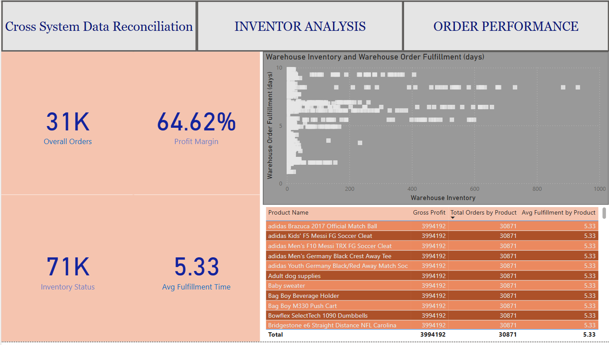

# Cross System Data Reconciliation

## Overview
This repository contains SQL scripts and analysis for the Crosstem database, focusing on reconciling data across inventory, orders, shipments, and fulfillment systems. The dashboard solution provides comprehensive analytics for order performance, inventory management, and sales trend analysis.




## Database Structure
The Crosstem database consists of the following main tables:
- `orders_and_shipments`: Contains order data, shipment information, and sales metrics
- `inventory`: Tracks warehouse inventory levels and cost data
- `fulfillment`: Contains order fulfillment metrics and processing times

## Key Metrics
The solution monitors several key performance indicators:
- 31K overall orders processed
- 64.62% overall profit margin
- 71K inventory items tracked
- 5.33 days average fulfillment time

## SQL Scripts
The repository includes various SQL queries categorized by analysis type:

### 1. Basic Exploration and Aggregation
- Total gross sales and profit calculations
- Sales and profit by product department/category
- Top selling products by quantity and profitability
- Sales trends over time (monthly and yearly)
- Geographic analysis (customer market, region, country)
- Discount impact analysis
- Shipment metrics

### 2. Time-Based Analysis
- Month-over-month sales growth calculations
- Year-over-year sales growth analysis
- Seasonal trend identification

### 3. Customer Analysis
- Top customers by purchase amount
- Customer retention metrics
- Geographic distribution analysis

### 4. Inventory Analysis
- Total inventory value calculations
- Inventory value by product category
- Stockout/overstock risk identification
- Estimated COGS and gross profit calculations

### 5. Fulfillment Analysis
- Average fulfillment time by product
- Relationship between fulfillment time and sales
- Order processing efficiency metrics

## Dashboard Components
The solution includes an interactive dashboard with three main sections:

### Cross System Data Reconciliation
Displays high-level metrics showing the reconciliation between different systems:
- Order counts (31K overall orders)
- Profit margin (64.62%)
- Inventory status (71K items)
- Average fulfillment time (5.33 days)

### Inventory Analysis
Provides detailed inventory insights:
- Warehouse inventory levels vs. fulfillment time scatter plot
- Total inventory cost by product category (pie chart)
- Detailed inventory counts and cost per unit by product

### Order Performance
Shows sales and profit analytics:
- Gross profit by customer region
- Gross profit by product category
- Order distribution by customer country

## Usage

### Prerequisites
- SQL Server Management Studio (SSMS)
- Access to the Crosstem database

### Running the Scripts
1. Open SSMS and connect to your server
2. Set the Crosstem database as the context using:
   ```sql
   USE [Crosstem]
   GO
   ```
3. Execute the desired query scripts based on your analysis needs

### Dashboard Access
The Power BI dashboard can be accessed via the corporate intranet or by opening the `Cross_System_Data_Dashboard.pbix` file with Power BI Desktop.

## Data Reconciliation Process
The reconciliation process involves:
1. Extracting data from multiple source systems
2. Transforming and standardizing the data formats
3. Loading the data into the Crosstem database
4. Running validation queries to identify discrepancies
5. Generating reports and visualizations for analysis

## Maintenance
- Scripts are scheduled to run daily at 2:00 AM
- Dashboard data refreshes every 4 hours
- Monthly data quality checks are performed on the 1st of each month

## Contributors
- Data Engineering Team
- Business Intelligence Team
- Sales Operations Department

## License
Internal use only - Proprietary and Confidential
